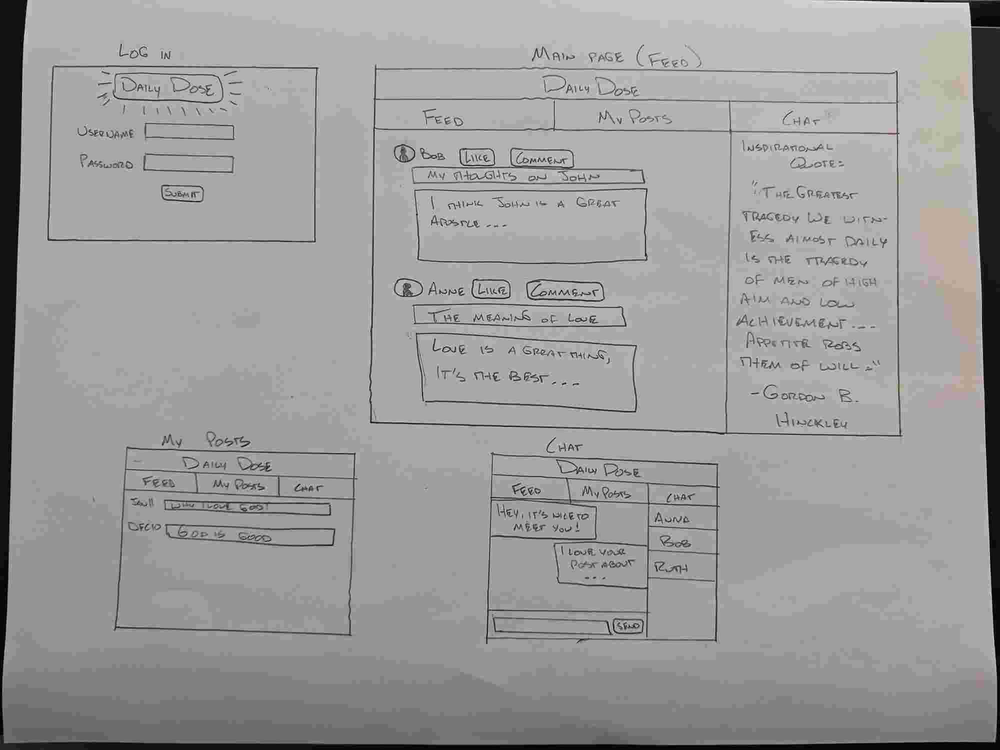

 - Here are my notes: [Notes](notes.md)

# Startup specifications:
## The Idea
I am going to create a social media site called ***DailyDose***. The purpose of this social media page will be to share uplifiting stories, quotes, and thoughts about the scriptures and the Gospel of Jesus Christ. This is to pursue the call of the General Authorities of The Church of Jesus Christ of Latter-day Saints to share the Gospel using social media. ***DailyDose*** will be a site that people can visit to feel hope in their daily life and to remove themselves from the negative environments that plague other social media sites.

***DailyDose*** users will be able to do the following things on the site:
  1. _Post_ thoughts, insights, and stories to uplift others
  2. _Like_ others' posts
  3. _View_ a daily quote from inspirational leaders and thinkers
  4. _Chat_ with other users about Gospel topics
 
## The Technologies
  Here is how I am going to use each of the technologies in 
   1. **Authentication:** Each memeber will have to login to their account in order to post, comment, like, or chat.
   2. **Database data:** The database will store the posts and chats of each of the users of the site.
   3. **WebSocket Data:** The site will pull inspirational quotes from other websites. Also, users will be able to communicate with eachother on the site.

## The Vision
**Here is how I envision the website:**

# HTML Deliverable
In this deliverable, I put in place the structure of my website.
- ***HTML Pages:*** I added 4 HTML pages to the website
  - _Main_ page
  - _Feed_ page
  - _Chat_ page
  - _My Posts_ page
- ***Links:*** The _Main_ page automatically links to the _Feed_ page when a user logs in. Each page has links to all of the pages at the top.
- ***Text:*** The posts in the _My Posts_ page are represented by text. The chat in the _Chat_ page is represented by text. The posts in the _Feed_ are represented by text.
- ***Application Images:*** Each page has an image at the top of it, the logo or icon for the page.
- ***Login:*** The _Main_ page has a Username and Password field, along with a submit button, for a user to login to their account on the site.
- ***Database:*** The posts on the _My Posts_ page represent the data stored in and pulled from the database.
-  ***WebSocket:*** The _Chat_ page and the inspirational quote on the _Feed_ page show realtime data and data being pulled from another server.

# CSS Deliverable
In this deliverable, I added style to my content and some rough functionality with it.
- ***Header, Footer, and Main Content Body:*** I added styling for each part of each of my HTML pages.
- ***Navigation Elements:*** I put the navigation elements in a box, spaced evenly and separated by lines. I made the links light up when they are hovered over.
- ***Responsive to window resizing:*** I make the header and footer disappear if the screen gets too small. I make the inspirational quote move to the top of the feed page if the window gets too small. The login/sign up buttons resize for a smaller window.
- ***Application elements:*** I used great contrast and white space. I used borders nicely to modularize the sections on each page. 
- ***Application text content:*** My fonts are consistent. I have bold font where needed. 
- ***Application Iamges:*** I made the image I had on my site into the background image for the top of my site. 

# JavaScript Deliverable
In this deliverable, I added all the functionality to my website.
- ***Login:*** You can toggle between logging in and signing up. As you enter the username and password, it checks to make sure they fit the required format. When you hit login, it stores the username in the local storage to display on the other pages.
- ***Database:*** It pulls the posts from the database to populate the feed.html page. It displays the chats with other users that are stored.
- ***WebSocket:*** I made that chat update whenever somebody writes to another person. This will be replaced by websockets later. I also have a spot for the inspirational quote on the feed that will be filled in later by the WebSocket data rather than the one quote I have.
- ***Application Logic:*** The chats page reloads based on user interaction by making new chats, selecting a chat to look at, and sending a message in a chat.

# Service Deliverable
In this deliverable, I created an HTTP server and moved most of the functionality to it. I set up many service endpoints for my site.
- ***Node.js/Express HTTP Service:*** I made my server!
- ***Static Middleware for Frontend:*** I moved my other deliverables into a `public` folder for call when my server starts up.
- ***Calls to Third-party Endpoints:*** I called a third party for the 'Inspirational Quote' on my feed page.
- ***Backend Service Endpoints:*** There are arrays for the _User Data_, _Posts_, and _Users_ that store the memory for the application. There are endpoints that call, update, and return the data in these arrays.
- ***Frontend Calls Service Endpoints:*** The frontend uses the fetch function to get data from the server to then display it on the website. 

# Database Deliverable
In this deliverable, I set up my database on MongoDB and begin to access it from my server.
- ***MongoDB Atlas Database Created:*** I created my MongoDB Atlas account and access it from my server.
- ***Endpoints for Data:*** I use the endpoints on my server to update the data that is stored in my database.
- ***Stores Data in MongoDB:*** I store a couple of arrays of data in MongoDB that hold the data received from my frontend.
